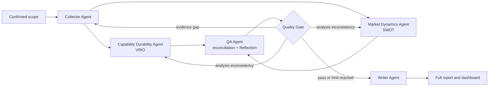

# RivalTrackAgent

**English** | [简体中文](README.zh-CN.md)

RivalTrackAgent is a LangGraph-based multi-agent system for evidence-grounded competitive intelligence. Five specialized agents collect evidence, analyze competitors through independent methods, reconcile disagreements, enforce quality gates, and produce a decision-oriented Chinese report.

## Highlights

- **Five specialized agents:** Collector, Capability Durability Analyst, Market Dynamics Analyst, QA, and Writer.
- **Reasoning and planning:** evidence-driven ReAct collection, independent VRIO/SWOT analysis, QA Reflection, and conditional rework.
- **Two memory mechanisms:** LangGraph short-term checkpoints and persistent long-term conclusions; historical conclusions are context, never current evidence.
- **Multiple tools:** web search, community search, readable-page extraction, relevance scoring, evidence-quality assessment, and benchmark utilities.
- **Evidence before scoring:** search snippets are only leads; a concrete page must be readable, relevant, and traceable before it can support the Threat Matrix.
- **Decision-ready output:** competitor profiles, four-dimensional threat scores, evidence coverage, disagreements, prioritized actions, limitations, Markdown/CSV export, and printable PDF.
- **Human-controlled revision:** annotations may highlight text, record a comment, request more evidence, or propose an AI revision; accepted revisions preserve version history.

## Multi-agent workflow



The Quality Gate is deterministic routing logic rather than a sixth agent. It checks evidence coverage, matrix completeness, method traces, disagreement resolution, and action quality.

## Threat model

Every competitor is assessed relative to a confirmed **Threat Target** across four dimensions:

1. User substitution
2. Capability catch-up
3. Distribution
4. Strategic expansion

Evidence is organized into an O/B/C/L portfolio:

- **O — Official:** product pages, announcements, filings, documentation
- **B — Benchmark:** reputable news, industry research, independent comparisons
- **C — Community:** concrete public discussions and user feedback
- **L — Leading indicator:** hiring, patents, tenders, funding use, partnerships, roadmaps

## Requirements

- Python 3.12
- A DeepSeek-compatible model key
- A modern browser
- Optional: Bocha Search API for live web and community discovery
- Optional: Crawl4AI and Playwright for dynamic page extraction

## Quick start

### PowerShell / Windows

```powershell
conda create -n rivltrack python=3.12 -y
conda activate rivltrack
python -m pip install -r requirements.txt
Copy-Item .env.example .env
# Add DEEPSEEK_API_KEY to .env; BOCHA_SEARCH_API_KEY is optional.
python src/main.py
```

### Bash / macOS / Linux

```bash
python -m venv .venv
source .venv/bin/activate
python -m pip install -r requirements.txt
cp .env.example .env
# Add DEEPSEEK_API_KEY to .env; BOCHA_SEARCH_API_KEY is optional.
python src/main.py
```

The server opens the dashboard and runs the default pipeline. For a custom analysis, create a new analysis, enter the target product, confirm or edit the detected track, select automatically discovered competitors, and add missing competitors with `+` before freezing the scope.

## Optional dynamic-page support

```bash
python -m pip install -r requirements-crawl.txt
crawl4ai-setup
playwright install chromium
```

Never automate login walls, CAPTCHA bypasses, or private-account access. Login-gated pages remain candidate leads unless the user provides a lawful, citable excerpt.

## Project structure

```text
RivalTrack/
├── src/
│   ├── agents/       # prompts, analysis lenses, ReAct tools
│   ├── client/       # model client, retries, output normalization
│   ├── config/       # industry routing, query and scoring configuration
│   ├── frontend/     # dashboard and full-report interface
│   ├── intake/       # scope, discovery, search, extraction, quality gates
│   ├── memory/       # long-term memory and evidence workspace
│   ├── models/       # Pydantic output and decision contracts
│   ├── pipeline/     # LangGraph DAG, nodes, QA and Quality Gate routing
│   ├── reporting/    # annotation-driven report revision
│   ├── tools/        # replay and benchmark commands
│   └── main.py       # HTTP/WebSocket entry point
├── data/             # reproducible input and fallback snapshots
├── docs/             # selected technical documentation
└── tests/            # offline regression and integration suite
```

See [src/README.md](src/README.md) for the implementation map and [CONTEXT.md](CONTEXT.md) for the domain glossary.

## Verification

```bash
python -m pip install -r requirements-dev.txt
python -m pytest -q
```

The public snapshot currently contains 190 offline tests. Tests mock external model and search calls.

## Replay and benchmarks

```bash
python src/tools/run_real_pipeline.py --preset ai-coding
python src/tools/run_real_pipeline.py --preset milktea --agent-tools
python src/tools/benchmark_domains.py
python src/tools/benchmark_domains.py --search
```

Commands using the real model or search chain require the corresponding credentials. Generated benchmark reports are written under `data/benchmark/` and are ignored by Git.

## Data and security

- Never commit `.env`, API keys, cookies, browser profiles, runtime logs, or evidence workspaces.
- Files under `data/` are reproducibility snapshots, not current market claims.
- Search summaries and candidate URLs cannot support scores until their content pages pass validation.
- Fetched pages and user-supplied excerpts are untrusted input; SSRF protections must remain enabled.
- Review [SECURITY.md](SECURITY.md), [data/README.md](data/README.md), and [PUBLIC_RELEASE.md](PUBLIC_RELEASE.md) before redistribution.

## Documentation

- [Runtime checklist](docs/runtime-checklist.md)
- [Development environment](docs/development-environment.md)
- [Technical report](docs/agent-application-technical-report.md)
- [Example source data](docs/example_data.md)
- [Crawl4AI integration](docs/crawl4ai-integration.md)
- [Contributing guide](CONTRIBUTING.md)

