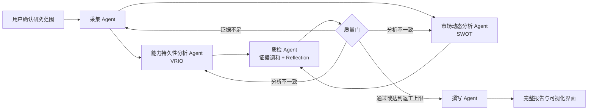

# RivalTrackAgent

[English](README.md) | **简体中文**

RivalTrackAgent 是一个基于 LangGraph 的证据驱动型竞品情报多智能体系统。五个定位明确的 Agent 依次完成证据采集、双方法独立分析、分歧调和、质量复审和决策报告撰写，并通过中文可视化界面呈现完整证据链。

## 核心特性

- **五个专业 Agent：**采集 Agent、能力持久性分析 Agent、市场动态分析 Agent、质检 Agent和撰写 Agent。
- **推理与规划：**证据驱动的 ReAct 采集、独立 VRIO/SWOT 分析、QA Reflection，以及条件返工流程。
- **两类记忆：**LangGraph 短期检查点与持久化长期结论；历史结论只作为背景，不替代当前证据。
- **多种工具：**网页搜索、社区搜索、正文读取、相关性评分、证据质量评估和跨领域基准测试。
- **先验证证据再评分：**搜索摘要只属于候选线索；具体内容页必须可读、相关且可追溯，才能进入威胁矩阵。
- **面向决策的输出：**竞品画像、四维威胁评分、证据覆盖、方法分歧、行动清单、局限性、Markdown/CSV 导出和 PDF 打印。
- **人工可控修订：**批注可以仅高亮、记录意见、要求补证或生成 AI 修改建议；只有用户接受后才替换正文，并保留版本历史。

## 多智能体协作流程



质量门不是第六个 Agent，而是确定性的流程路由逻辑。它检查证据覆盖、矩阵完整性、方法推理轨迹、分歧调和和行动质量。

## 威胁分析模型

系统始终相对于用户确认的**我方产品（Threat Target）**评估每个竞品，而不是评价竞品的一般市场实力。四个威胁维度为：

1. 用户替代威胁
2. 能力追赶威胁
3. 分发渠道威胁
4. 战略扩张威胁

证据按照 O/B/C/L 四类组合组织：

- O——官方来源：产品页面、公告、财报、官方文档
- B——基准来源：权威新闻、行业研究、独立对比
- C——社区来源：可定位的公开讨论和用户反馈
- L——前瞻信号：招聘、专利、招投标、融资用途、合作和路线图

## 环境要求

- Python 3.12
- DeepSeek 兼容模型密钥
- 现代浏览器
- 可选：博查搜索 API，用于真实网页和社区内容发现
- 可选：Crawl4AI 与 Playwright，用于动态网页正文提取

## 快速开始

### PowerShell / Windows

```powershell
conda create -n rivltrack python=3.12 -y
conda activate rivltrack
python -m pip install -r requirements.txt
Copy-Item .env.example .env
# 在 .env 中填写 DEEPSEEK_API_KEY；BOCHA_SEARCH_API_KEY 为可选项。
python src/main.py
```

### Bash / macOS / Linux

```bash
python -m venv .venv
source .venv/bin/activate
python -m pip install -r requirements.txt
cp .env.example .env
# 在 .env 中填写 DEEPSEEK_API_KEY；BOCHA_SEARCH_API_KEY 为可选项。
python src/main.py
```

服务启动后会自动打开可视化界面并运行默认流程。新建自定义分析时，只需先输入我方产品名称，然后确认或修改自动识别的赛道、勾选自动发现的竞品，并通过 `+` 添加遗漏竞品，最后冻结研究范围。

## 可选动态网页支持

```bash
python -m pip install -r requirements-crawl.txt
crawl4ai-setup
playwright install chromium
```

系统不应自动绕过登录墙、验证码，也不读取私人账号内容。登录受限页面只能保留为候选线索，除非用户合法提供可引用的正文摘录。

## 项目结构

```text
RivalTrack/
├── src/
│   ├── agents/       # 提示词、分析透镜与 ReAct 工具
│   ├── client/       # 模型调用、重试与输出归一化
│   ├── config/       # 行业路由、检索模板与评分配置
│   ├── frontend/     # 可视化仪表盘与完整报告界面
│   ├── intake/       # 范围确认、搜索、正文提取与质量验证
│   ├── memory/       # 长期记忆与证据工作区
│   ├── models/       # Pydantic 输出和决策契约
│   ├── pipeline/     # LangGraph DAG、Agent 节点和质量门路由
│   ├── reporting/    # 批注驱动的报告修订
│   ├── tools/        # 真实流程复跑和基准测试工具
│   └── main.py       # HTTP/WebSocket 程序入口
├── data/             # 可复现输入和 fallback 快照
├── docs/             # 精选技术文档
└── tests/            # 离线回归与集成测试
```

多智能体结构详细代码位置参见 [src/README.md](src/README.md)，领域术语参见 [CONTEXT.md](CONTEXT.md)。

## 测试验证

```bash
python -m pip install -r requirements-dev.txt
python -m pytest -q
```

当前公开副本包含 190 项离线测试；外部模型和搜索调用均使用模拟实现，不要求真实 API。

## 真实流程复跑与基准测试

```bash
python src/tools/run_real_pipeline.py --preset ai-coding
python src/tools/run_real_pipeline.py --preset milktea --agent-tools
python src/tools/benchmark_domains.py
python src/tools/benchmark_domains.py --search
```

真实模型或搜索链路需要配置相应密钥。基准测试结果写入 `data/benchmark/`，该目录默认不进入 Git。

## 数据与安全说明

- 不要提交 `.env`、API 密钥、Cookie、浏览器配置、运行日志或证据工作区。
- `data/` 中的内容用于复现和演示，不代表当前市场事实。
- 搜索摘要与候选 URL 在正文通过验证前不能支持评分。
- 抓取页面和用户提交摘录均属于不可信输入，必须保留 SSRF 防护。
- 公开发布前请阅读 [SECURITY.md](SECURITY.md)、[data/README.md](data/README.md) 和 [PUBLIC_RELEASE.md](PUBLIC_RELEASE.md)。

## 文档入口

- [运行检查清单](docs/runtime-checklist.md)
- [开发环境说明](docs/development-environment.md)
- [系统技术报告](docs/agent-application-technical-report.md)
- [示例来源数据](docs/example_data.md)
- [Crawl4AI 集成说明](docs/crawl4ai-integration.md)
- [贡献指南](CONTRIBUTING.md)

