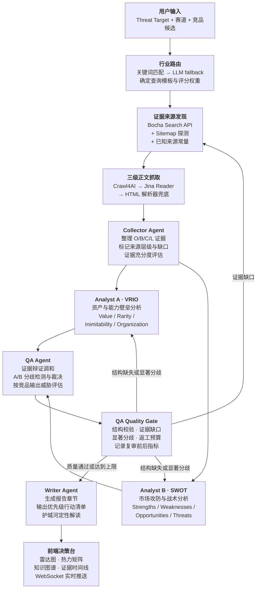
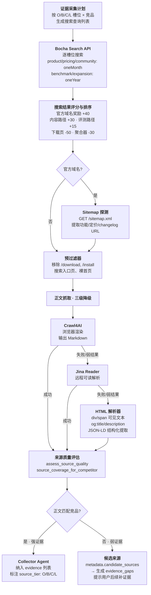

# RivalTrackAgent 智能体应用赛道技术报告书

## 一、项目概述

### 1.1 项目名称

RivalTrackAgent 竞品分析决策台

### 1.2 参赛赛道

智能体应用赛道。

本项目聚焦真实业务场景中的竞品威胁分析，基于大模型与多智能体编排，将“竞品发现、证据采集、方法论分析、交叉质检、行动建议生成”串联为一个可演示、可扩展、可落地的决策支持系统。

### 1.3 项目定位

RivalTrackAgent 面向产品、增长、战略负责人，回答一个具体问题：

> 竞品到底如何威胁我方产品？我们下一步应该做什么？

系统以“我方产品”为中心，自动补全同领域竞品候选，采集公开证据，生成四维威胁矩阵，并输出可直接拆成 issue 的行动清单。

项目不是泛化的竞品资料汇总工具，而是一个“对我方威胁”分析台。它强调三个原则：

1. 威胁必须指向我方产品，而不是泛泛评价竞品强弱。
2. 结论必须能追溯到证据来源，并标记证据是否充分。
3. 报告必须落到行动，覆盖产品、增长、战略三类负责人可执行的动作。

## 二、应用场景与需求分析

### 2.1 目标用户

- 产品负责人：判断竞品功能、体验、定价是否会造成用户迁移，并据此调整路线图。
- 增长负责人：识别竞品渠道、分发、生态和营销优势，形成增长实验。
- 战略负责人：观察赛道格局、相邻市场侵入、能力追赶和长期竞争压力。

### 2.2 核心痛点

- 输入成本高：传统分析要求用户提前整理赛道、竞品、链接和证据。
- 结论太抽象：报告常写“威胁较高”“值得关注”，但缺少维度、分数和证据。
- 证据链弱：结论和来源之间没有明确关联，难以判断可信度。
- 方法论混乱：行业级分析框架容易被误用到单个竞品，导致评分逻辑不严谨。
- 行动断层：用户知道威胁后，仍不清楚由谁做、做什么、先做哪一项。

### 2.3 产品目标

系统抽象出四个核心目标：

1. 最小输入启动：用户只需填写“我方产品名称”，其他字段均可选。
2. 同领域竞品发现：默认生成 3 个候选竞品，最多 5 个，并按直接替代品、能力追赶者、渠道/生态强者优先排序。
3. 四维威胁矩阵：行是竞品，列是用户替代、能力追赶、分发渠道、战略扩张，最后一列是综合等级。
4. 行动闭环：Writer Agent 按“威胁强度 × 紧迫性 × 可行动性”排序，输出 issue-ready 行动建议。

## 三、系统架构

### 3.1 总体流程



### 3.2 技术栈

- **前端**：原生 HTML5/CSS3/JavaScript (ES6+)，无框架依赖，零构建步骤。
- **图表**：Chart.js 4.4 绘制多维雷达图，Cytoscape.js 3.30 绘制竞争知识图谱与分歧关系可视化。
- **后端**：Python 3.12，基于 asyncio 异步架构。HTTP 静态服务与 API 使用 aiohttp 3.9，WebSocket 实时推送使用 websockets 13.0。
- **智能体编排**：LangGraph >=1.0.0，基于 StateGraph 声明式 DAG，内置 fan-out（Collector → 双 Analyst 并行）和 fan-in（双 Analyst → QA 自动汇聚）。QA Quality Gate 使用条件边把证据缺口返回工具规划与 Collector，把结构缺失或显著分歧返回双 Analyst，并通过返工上限防止无限循环。
- **大模型调用**：DeepSeek API，通过 OpenAI 兼容 SDK（openai >=1.0.0）调用，内置指数退避重试、结构化 JSON 输出解析、Schema 校验与 refusal 检测。所有 Agent 统一 token 预算（max_tokens=16384, timeout=120s），避免多竞品场景下输出截断。
- **数据契约**：Pydantic v2 定义全链路数据模型，包括 `AgentNodeOutput`、`EvidenceRef`、`WSMessage`、`ThreatAssessment` 等，确保前后端与 Agent 间类型安全。合约层采用 `model_copy` 防御性复制，消除并发竞态风险。
- **行业路由与可配置评分**：支持 8 种行业类型（software_saas、retail_fmcg、automotive 等），通过关键词匹配 + LLM fallback 自动路由到对应的查询模板（`query_templates_{industry}.yaml`）和评分权重（`scoring_{industry}.yaml`）。搜索评分规则（域名奖励、路径惩罚、内容农场抑制）和证据槽位查询模板可脱离代码配置。
- **证据采集与清洗**：Bocha Web Search API 搜索公开证据，按证据槽位分级设置时效性（product/pricing/community 槽位 oneMonth，benchmark/expansion 槽位 oneYear），自动探测官网 sitemap.xml 提取功能/定价/changelog URL，下载页和搜索入口页在抓取前预过滤。页面正文提取采用三层级联——Crawl4AI 作为主提取器（浏览器渲染，输出 Markdown），Jina Reader 作为首级降级，内置 HTML 可读文本解析器作为最终兜底。可通过 `CRAWL4AI_ENABLED` 环境变量控制 Crawl4AI 开关。
- **离线演示**：内置 AI 代码助手（GitHub Copilot）、新茶饮（霸王茶姬）两组预缓存 fallback 数据，覆盖完整 Pipeline 输出。支持通过 `RIVALTRACK_AUTORUN=true` 环境变量自动启动演示流程。

## 四、智能体架构设计

### 4.1 Agent 分工

| Agent     | 方法/职责                                 | 主要输出                                                   |
| --------- | ----------------------------------------- | ---------------------------------------------------------- |
| Collector | 整理 O/B/C/L 证据，标记来源质量和缺口     | evidence、source coverage、evidence_insufficient           |
| Analyst A | VRIO 框架，分析竞品资产与能力壁垒         | threat_scores、per_competitor_notes                        |
| Analyst B | SWOT 框架，分析市场攻防与战术破绽         | threat_scores、per_competitor_notes                        |
| QA        | 证据辩证调和，复核 A/B 分歧并生成正式矩阵 | reconciled threat_scores、threat_assessment、disagreements |
| Writer    | 生成正式报告与行动建议                    | report_sections、response_actions                          |

### 4.2 VRIO 与 SWOT 双分析框架

系统采用两套互补的方法论，让分歧来自分析视角，而不是“乐观/悲观”人格标签。

Analyst A 使用 VRIO 框架，关注竞品的底层资产与能力壁垒：

- Value：竞品能力是否真正创造用户价值。
- Rarity：该能力是否稀缺。
- Inimitability：该能力是否难以复制。
- Organization：竞品组织是否能持续把能力转化为市场结果。

Analyst B 使用 SWOT 框架，关注竞品在当前市场交战中的攻防形势：

- Strengths：竞品已经形成的优势。
- Weaknesses：竞品暴露出的短板。
- Opportunities：竞品可能利用的市场机会。
- Threats：对我方产品构成的现实威胁。

两位分析师看到相同证据，但从不同方法论出发：

- VRIO 更擅长判断“骨骼壁垒”，例如技术资产、渠道壁垒、生态锁定、组织执行能力。
- SWOT 更擅长判断“战术破绽”，例如用户迁移、价格战、渠道冲突、相邻场景侵入。

这种设计让系统既能评估竞品的长期壁垒，也能捕捉短期市场动作，从而避免单一框架导致的分析偏差。

### 4.3 QA 的证据辩证调和策略

QA Agent 不机械套用固定权重，而是进行证据辩证调和：

- 当 A/B 分数差距较大时，记录分歧维度、分差和双方论据。
- Official 来源更适合验证功能、定价、产品定位，但可能带营销倾向。
- Benchmark 来源更适合验证行业评价、性能、规模和第三方事实。
- Community 来源更适合验证真实用户痛点，但需要防止样本偏差。
- Leading Indicators 适合判断前瞻趋势，但不能当作已经落地的产品事实。

QA 最终输出按竞品组织的 `threat_assessment`，包含等级、分数、证据充分度、关键来源和调和理由。

### 4.4 QA Quality Gate 与条件返工

QA Reflection 完成后，Quality Gate 使用确定性规则复核结果，而不是仅依赖模型自评：

- 威胁矩阵或逐竞品判断结构不完整：同时返回 Analyst A 与 Analyst B 重新计算。
- 存在证据缺口且联网工具已启用：返回 Tool Planner 和 Collector 定向补采。
- 存在分差达到阈值的显著方法分歧：返回双 Analyst 复核；普通文字差异只记录，不触发昂贵返工。
- 质量通过或达到 `max_rework_rounds`：进入 Writer；达到上限时保留未解决问题和限制说明。

每轮复审写入 `quality_metrics` 和 `rework_history`，包括综合质量分、相对上一轮的分数变化、矩阵完整度、QA 置信度、证据缺口数、显著分歧数和结构错误数。默认最多自动返工一次，可通过 `run_pipeline` 或 `run_pipeline_custom` 的 `max_rework_rounds` 调整。

## 五、数据采集与证据体系

### 5.1 O/B/C/L 来源分层

| 类型 | 名称               | 示例                                                            | 用途                             |
| ---- | ------------------ | --------------------------------------------------------------- | -------------------------------- |
| O    | Official           | 官网、公告、帮助中心、产品文档                                  | 验证定位、能力、价格、渠道入口   |
| B    | Benchmark          | 行业报告、评测、榜单                                            | 验证规模、对比、第三方评价       |
| C    | Community          | 论坛、社媒、社区讨论、用户反馈                                  | 验证真实体验和替代意愿           |
| L    | Leading Indicators | 招聘、招投标、路线图、专利、融资用途、组织调整、GitHub 技术足迹 | 识别能力追赶和战略扩张的前瞻信号 |

当前工程重点落地了 Bocha Web Search 搜索、Crawl4AI/Jina Reader/HTML 解析器三层正文提取链路，以及开发者工具场景下的 GitHub 技术足迹候选。招聘、招投标、专利等 L 类来源已纳入框架与提示词，后续可继续接入专门 API。

### 5.2 搜索与清洗流程



系统遵循”精确少量强证据优先”。正文抓取采用 Crawl4AI（浏览器渲染，可处理 JS 页面）→ Jina Reader → HTML 解析器三级降级策略：Crawl4AI 优先尝试以浏览器环境渲染页面并提取 Markdown 正文；若失败或返回弱结果，则降级至 Jina Reader；最后以内置 HTML 解析器兜底。搜索入口、百科概览、无 URL 背景描述、过短文本、登录墙和 JavaScript 阻塞页面不会被当成强证据。它们会进入候选或背景信息，提示用户后续人工补证据。

### 5.3 自动发现证据来源

“自动发现证据来源”按钮的定位是：帮助用户发现可抓取的具体页面，而不是保证所有来源都能直接提取正文。配置 `BOCHA_SEARCH_API_KEY` 或 `WEB_SEARCH_API_KEY` 后，系统会优先合并真实搜索 API 结果；未配置时，返回离线候选来源。

UI 会区分：

- 强证据：具体官网、公告、文档、评测页面，且已抓到可读正文。
- 前瞻风向标：GitHub、招聘、路线图等可进一步验证的 L 类线索。
- 候选入口：搜索页、社区入口、百科背景，不直接计入强证据。

## 六、威胁评分模型

### 6.1 四维矩阵

系统内部使用 0-100 分，UI 显示为“高/中/低 + 分数”：

- 高：70-100
- 中：40-69
- 低：0-39

四个维度定义如下：

| 维度     | 含义                                   |
| -------- | -------------------------------------- |
| 用户替代 | 目标用户是否可能从我方产品迁移到该竞品 |
| 能力追赶 | 竞品是否覆盖或超过我方核心能力         |
| 分发渠道 | 竞品是否能更有效触达同一批用户         |
| 战略扩张 | 竞品是否正在进入我方关键相邻领域       |

综合分默认采用四维等权平均。后续可根据我方“当前竞争担忧”调整权重，例如增长团队更关注分发渠道，产品团队更关注能力追赶。

### 6.2 护城河处理原则

系统严格区分“竞品威胁强度”和“我方防御能力”：

- Analyst A/B 只评估竞品自身行为、能力和市场动作。
- 不允许因为我方品牌强、用户满意度高，就压低竞品威胁分。
- Writer 可以在报告中定性解释我方护城河如何缓冲威胁，但不改写矩阵分数。

这样可以避免“竞品很强，但因为我方也强所以分数很低”的混乱表达。

## 七、前端决策台设计

### 7.1 核心界面

前端围绕一页式决策台组织：

- 执行摘要：显示我方产品、核心结论、Agent 进度、置信度。
- 多维雷达图：比较竞品在四维威胁上的差异。
- 对我方威胁矩阵：按竞品展示四维分数和综合等级。
- 证据时间线：展示来源、摘录、置信度、抓取状态。
- 竞争知识图谱：展示赛道、竞品、证据、威胁判断和分歧。
- 分歧点区域：展示 A/B 方法论差异和 QA 调和结论。
- 行动建议清单：输出产品、增长、战略动作。

### 7.2 知识图谱语义

- 深色节点：赛道/市场边界。
- 白色节点：竞品产品或品牌主体。
- 蓝色节点：证据数量或证据来源。
- 橙色节点：威胁判断。
- 红色节点：分歧复核。
- 红色虚线：A/B 论据对撞，表示同一竞品或维度上存在显著分差。
- 黄线/绿线/红线：中、低、高威胁关系。

用户点击分歧红线时，可以查看 VRIO 与 SWOT 在具体维度上的分数差、论据对撞和 QA 调和理由。

## 八、可靠性与失败处理

### 8.1 自动重试与错误显式化

系统对关键节点设置保护：

- QA 如果没有生成四维威胁矩阵，会自动重试一次；仍失败则矩阵区域显示”威胁矩阵生成失败”。
- Writer 如果没有生成行动建议，会自动重试一次；仍失败则 UI 明确显示”行动建议生成失败”。
- DeepSeek 503 等服务不可用错误会显示友好错误信息。
- 自定义分析失败时不再自动广播 demo fallback，避免用户误以为样例是自己的分析结果。
- LLM 返回不完整 JSON 时会触发解析重试，降低截断响应导致整轮失败的概率。
- 证据字段验证：LLM 返回无法识别的字段名时记录 warning，防止证据链无声断裂。

### 8.2 证据不足策略

如果某竞品没有足够证据，系统仍允许继续分析，但会：

- 标记 `evidence_insufficient=true`。
- 降低该竞品和对应 Agent 输出置信度。
- 在采集结论中列出缺失维度。
- 在 UI 中提示“证据不足”，要求后续补充可读页面。

## 九、测试与验证

### 9.1 自动化测试

当前回归测试覆盖（105 tests, 9 files）：

- Pydantic 模型与 `threat_target` 兼容性验证。
- Bocha 搜索响应解析与结果排序、过滤、低质页面排除。
- 搜索评分权重加载与路径匹配规则（域名奖励、路径惩罚、内容农场抑制）。
- 查询模板按证据槽位渲染与占位符替换（`{name}`/`{track}`）。
- 下载页与搜索入口页预过滤、Sitemap 发现、水合流程。
- Crawl4AI/Jina Reader/HTML 解析器三层抓取、URL 构造与 Markdown 质量判断。
- O/B/C/L 来源候选生成与分组。
- 弱来源不计入强证据。
- 只输入我方产品时的竞品自动发现。
- 华为手机等场景的同领域竞品约束。
- 行业路由关键词匹配与 LLM fallback。
- QA 四维矩阵契约与按竞品威胁评估格式校验。
- Analyst 不输出整体威胁标签、不包含人格化 bias。
- 分歧检测基于矩阵分差（≥25 分触发），而非人格标签。
- 多竞品缓存不因 prompt 截断导致后置竞品完全无证据。
- Pipeline 集成测试：mock API 调用，验证 5 Agent DAG 输出顺序与数量。
- Quality Gate 三类路由、返工预算耗尽与复审指标计算。
- LangGraph 图级闭环：首次 QA 失败后双 Analyst 同时返工，第二次复审通过后才进入 Writer。

最近一次全量验证：

```text
pytest -q
105 passed in 9 files

node --check src/frontend/app.js
passed
```

### 9.2 证据采集基准工具

`src/tools/benchmark_links.py` 提供独立的采集 Agent 链接发现基准测试，支持按赛道批量评估证据覆盖率：

- 逐竞品统计 O/B/C/L 四类来源的候选 URL 数量和来源层级分布
- 输出表格报告 + JSON 详细结果
- 支持 `--search` 标志启用实时 Bocha 搜索 vs 离线候选来源对比
- 用于回归检测：配置或搜索策略变更后验证证据覆盖率不退化

### 9.3 已验证样例

项目内置两组可演示样例：

- AI 代码助手赛道：我方产品 GitHub Copilot。
- 新茶饮赛道：我方产品霸王茶姬。

竞品基础缓存按赛道分组存放：

- `data/competitor-data/ai-coding/`
- `data/competitor-data/milktea/`

fallback 数据用于离线演示，不再作为自定义分析失败时的自动替代结果，避免混淆用户输入与样例输出。

## 十、创新点

### 10.1 从“竞品强弱”转向“对我方威胁”

系统不评价竞品泛化实力，而是始终围绕我方产品进行相对威胁判断。一个竞品很强，但如果不争夺同一用户、能力或渠道，它的威胁分不应被夸大。

### 10.2 方法型双分析师架构

系统使用 VRIO 与 SWOT 两套管理学方法，而不是人格化的乐观/悲观对抗。这样让分歧具有分析价值，也降低了 prompt 人格标签带来的偏置。

### 10.3 前瞻风向标数据层

O/B/C 多数是滞后证据，L 类 Leading Indicators 用于补足前瞻性。招聘、招投标、路线图、专利、融资用途、组织调整和 GitHub 技术足迹都可以成为能力追赶和战略扩张的早期信号。

### 10.4 可解释的分歧红线

系统把多 Agent 的过程资产可视化为知识图谱中的分歧红线。用户不只看到最终结论，还能看到两个分析框架为何分歧，以及 QA 如何调和。

### 10.5 行动建议闭环

Writer Agent 输出的不只是总结，而是可开 issue 的行动清单。每条行动包含负责人类型、关联竞品、威胁维度、具体动作、证据依据、监控信号和置信度。

## 十一、当前限制与后续规划

### 11.1 当前限制

- 搜索 API 能返回具体页面，但部分站点仍可能登录受限或反爬。Crawl4AI 带浏览器渲染可解决大部分 JS 页面，但登录墙和验证码页面仍不可达。
- Crawl4AI、Jina Reader 和 HTML 解析器构成三级降级链，但仍无法保证所有社区平台都能提取正文（尤其是严格反爬或纯客户端渲染的平台）。
- L 类前瞻信号目前以框架和部分 GitHub 技术足迹为主，招聘、招投标、专利等仍需接入专门 API。
- 综合分暂为等权平均，尚未提供完整的用户权重配置界面。
- 行动建议已达到 issue-ready 文本，但尚未自动对接 GitHub Issues、Jira、飞书等系统。

### 11.2 后续规划

1. 接入招聘、招投标、专利、融资数据库，补齐 L 类前瞻信号。
2. 支持用户设置“当前竞争担忧”，动态调整四维权重。
3. 增加周期性监控任务，形成竞品变化趋势图。
4. 接入项目管理系统，把行动建议一键转为任务。
5. 增加人工反馈闭环，让用户确认结果反向优化后续分析。
6. 支持 PDF、Word、PPT 导出，适配答辩和企业汇报场景。

## 十二、总结

RivalTrackAgent 是一个面向真实业务决策的智能体应用。它围绕“竞品对我方产品的威胁”这一具体管理问题，构建了从证据采集、方法论分析、交叉质检到行动建议的完整闭环。

项目的核心价值在于：

- 用多智能体协作提升分析可靠性。
- 用四维矩阵降低抽象结论的误导性。
- 用 O/B/C/L 证据体系兼顾事实验证与前瞻预警。
- 用知识图谱和分歧红线增强可解释性。
- 用行动清单连接分析与执行。

因此，RivalTrackAgent 符合智能体应用赛道“聚焦场景落地与创意实现”的目标，具备可演示、可扩展、可商业化的应用价值。
